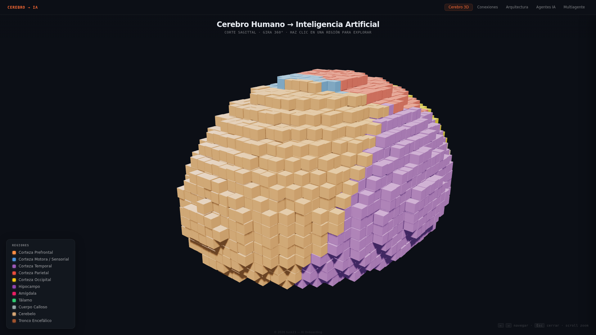
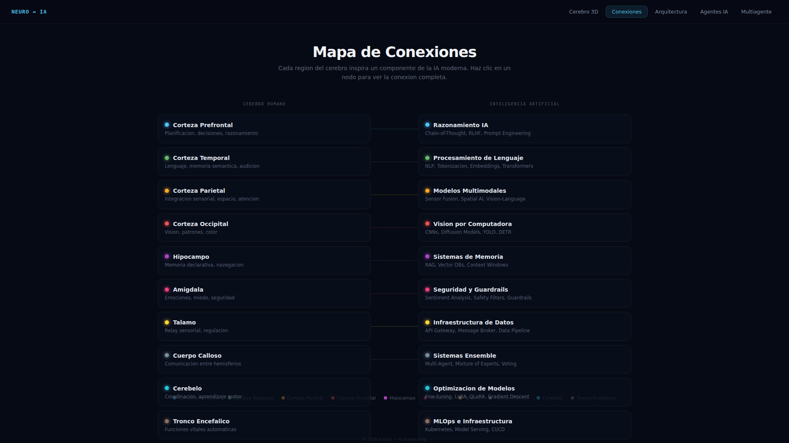
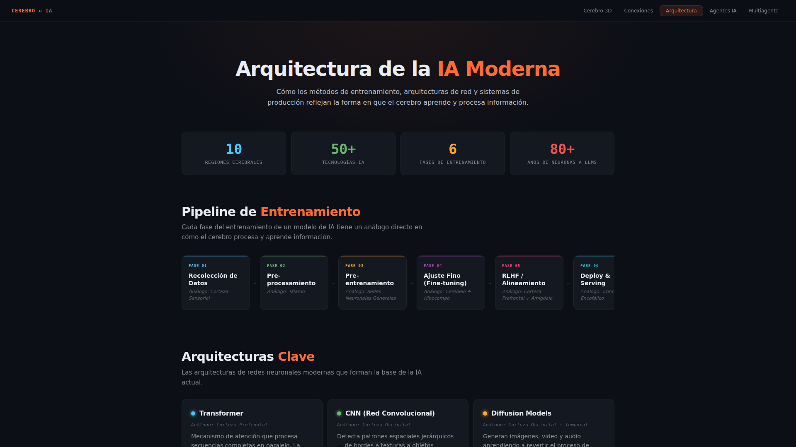
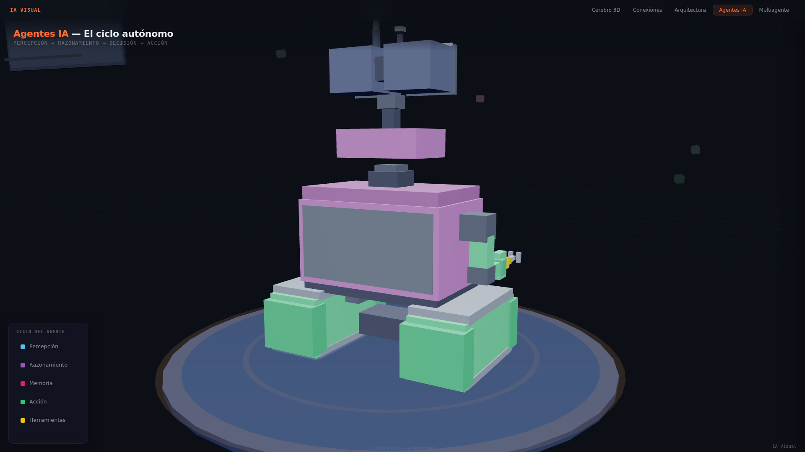

# LLM Concepts — Interactive 3D Presentation

Una presentación interactiva 3D que mapea conceptos de inteligencia artificial y sistemas multiagente con analogías de neurociencia. Construida con **React + Vite + Three.js**.

## 🧠 Conceptos

| Página | Ruta | Captura | Descripción |
|--------|------|---------|-------------|
| **Cerebro 3D** | `/` |  | Cerebro humano en vóxeles 3D con 11 regiones cerebrales y analogías con IA |
| **Conexiones** | `/conexiones` |  | Mapa SVG de conexiones cerebro ↔ IA |
| **Arquitectura IA** | `/arquitectura` |  | Diagrama de arquitectura de IA con pipeline y timeline |
| **Agentes IA** | `/agentes` |  | Ciclo autónomo de agentes con escena Three.js interactiva |
| **Multiagente** | `/multiagente` |  | 8 conceptos MAS con animaciones 3D |

## 🚀 Compilar y ejecutar

```bash
# 1. Clonar
git clone https://github.com/tusk23/ai-onboarding.git
cd ai-onboarding

# 2. Instalar dependencias
npm install

# 3. Desarrollo (hot-reload)
npm run dev

# 4. Build producción
npm run build

# 5. Preview del build
npm run preview
```

El servidor de desarrollo arranca en `http://localhost:5173/`.

## 🛠 Stack

| Capa | Tecnología |
|------|-----------|
| Framework | React 18 |
| Build | Vite 5 |
| 3D | Three.js r128 |
| Router | react-router-dom (HashRouter) |
| CSS | Archivos planos scoped por página |

## 🎨 Estructura del proyecto

```
src/
├── main.jsx              # Entry point con HashRouter
├── App.jsx               # 5 rutas
├── index.css             # Reset global
├── components/
│   └── SiteNav.jsx       # Navegación compartida
├── data/
│   └── regions.js        # Datos de regiones cerebrales
└── pages/
    ├── BrainPage.jsx + brain.css           # Cerebro 3D voxel
    ├── ConnectionMapPage.jsx + connection.css  # Mapa SVG
    ├── ArchitecturePage.jsx + architecture.css # Arquitectura
    ├── AgentsPage.jsx + agents.css         # Agentes IA
    └── MasPage.jsx + mas.css               # Multiagente (MAS)
```

## 🎯 Controles

| Acción | Control |
|--------|---------|
| Orbitar | Clic izquierdo + arrastrar |
| Zoom | Scroll |
| Pan | Clic derecho + arrastrar |
| Seleccionar concepto | Clic en agente 3D o en leyenda |
| Navegar entre conceptos | Flechas ← → |
| Cerrar panel | Escape o botón × |

## 👤 Watermark

© 2026 tusk23 — AI Onboarding. All rights reserved.

---

*Created with OpenCode*
